# Social App Concept-React Native🔥  

A simple social app concept with react native.
Improving day by day.

Star⭐ the repo if you like what you see😉.

<a href="ss/app.apk"></img></a>

## ✨ Requirements

- Any Operating System (ie. MacOS X, Linux, Windows)
- Any IDE with SDK installed (ie. IntelliJ, Android Studio, VSCode etc)
- A little knowledge of JavaScript and React Native

## 📸 ScreenShots

| Light                             | Dark                              |
| --------------------------------- | --------------------------------- |
| 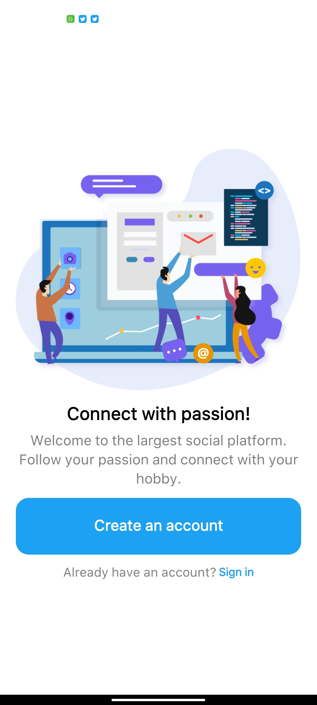 | 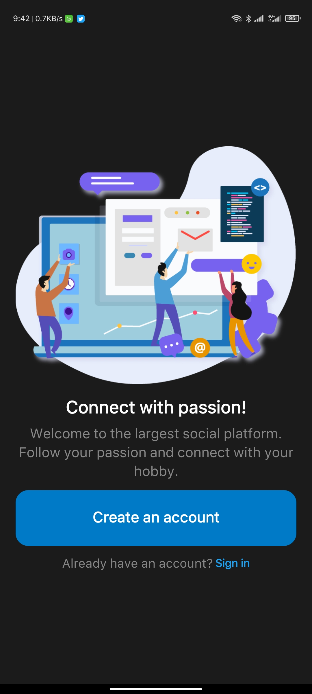 |
| 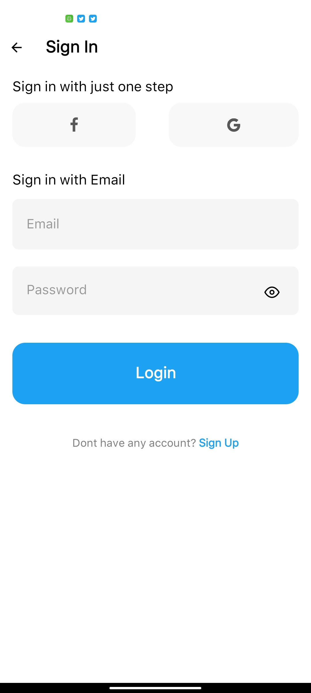 | 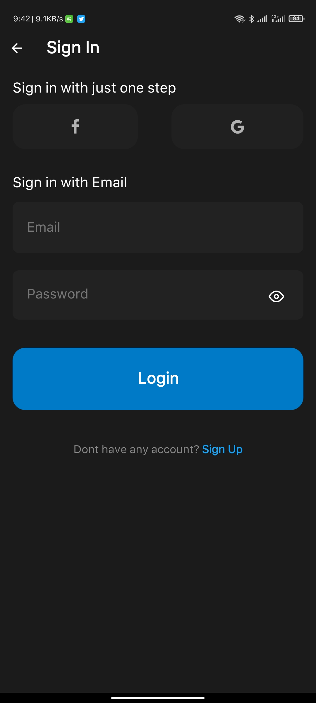 |
| 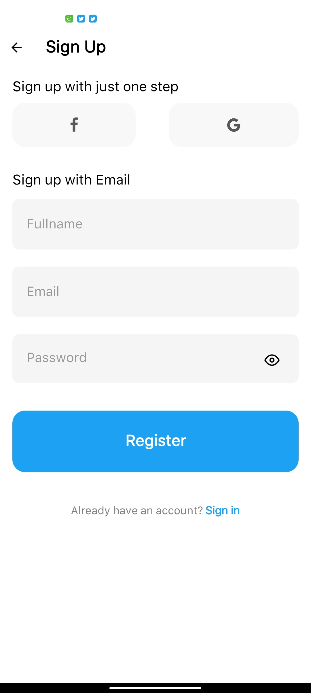 | 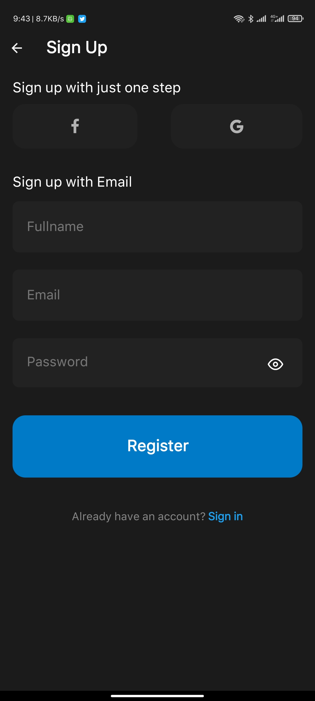 |
| 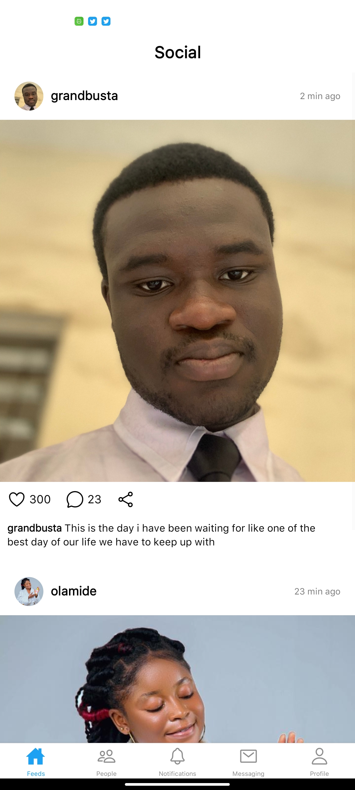 | 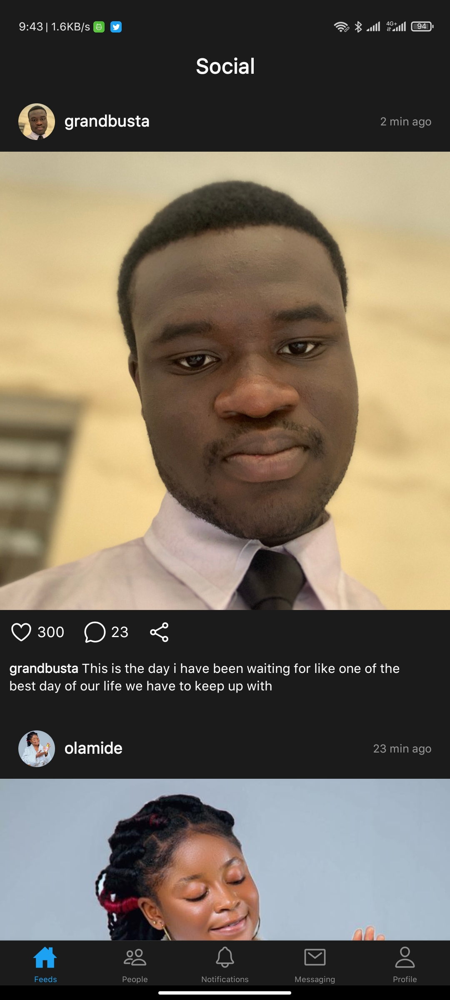 |
| 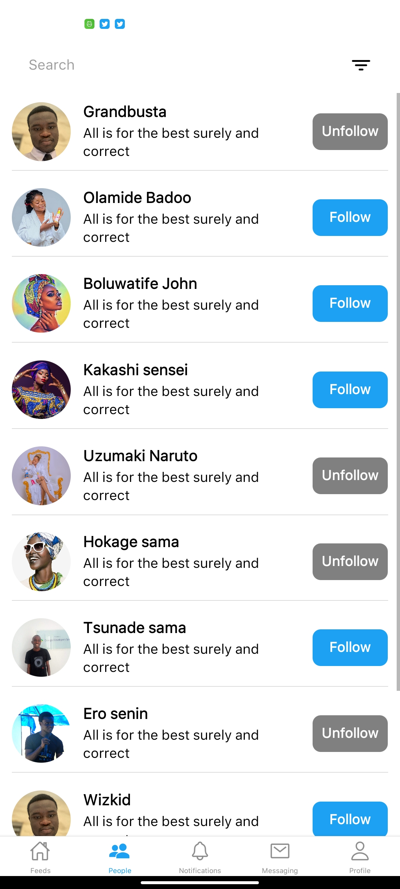 | 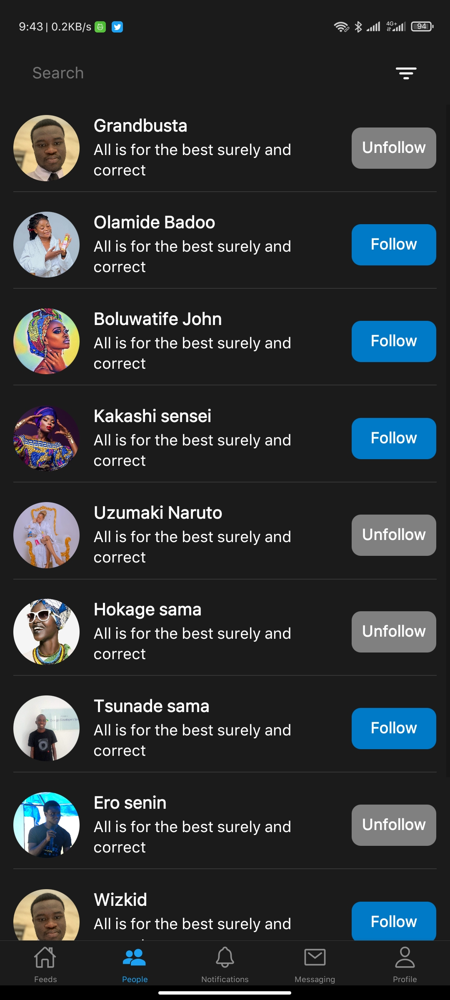 |
| 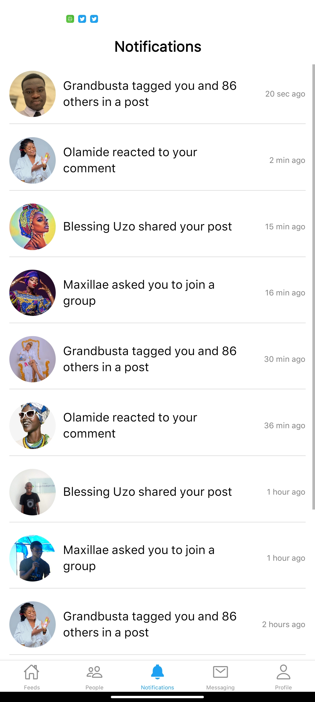 | 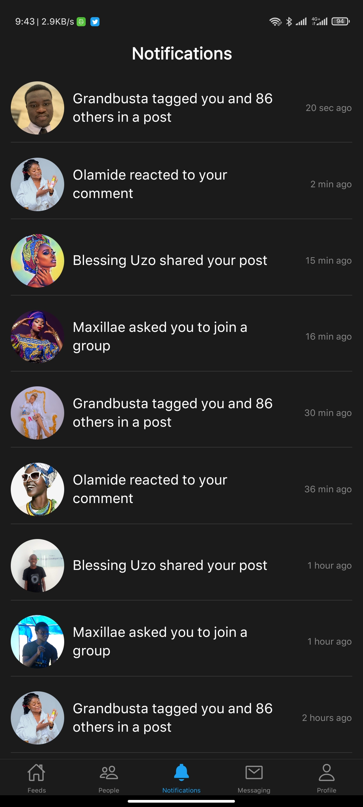 |
| 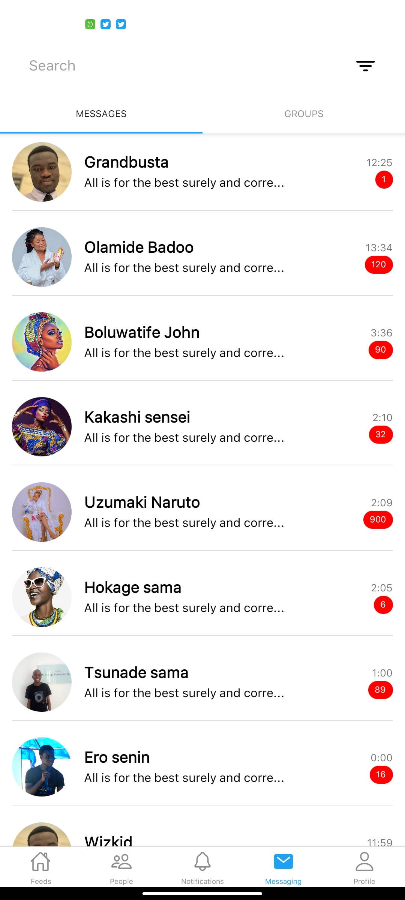 | 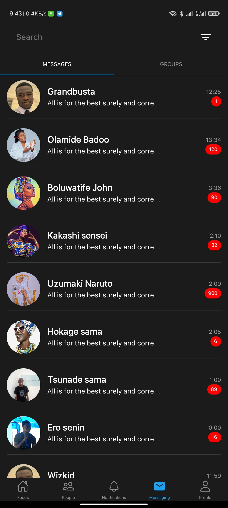 |
| 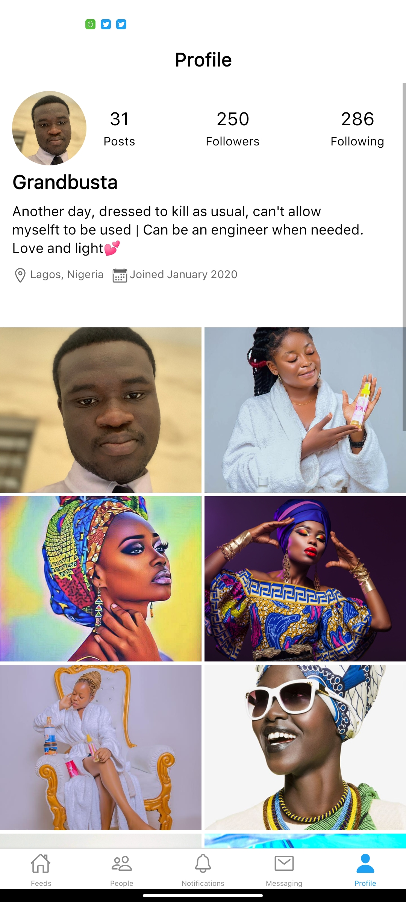 | 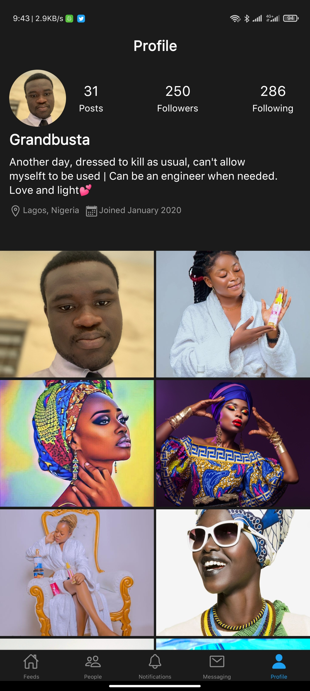 |
| 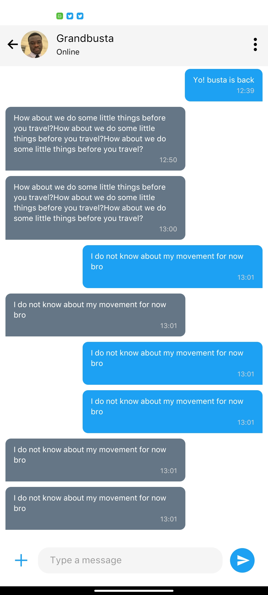 | 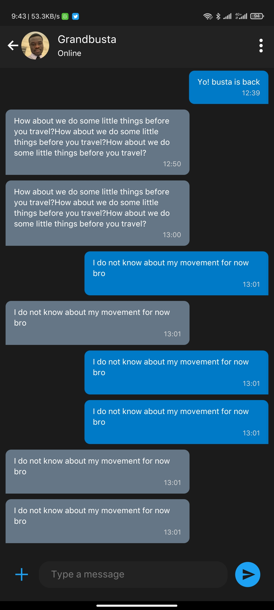 |

## 🌗 Dark theme

Adapts to device theme

## 🤓 Author(s)

**Olaifa Boluwatife Jonathan** 

## 🔖 LICENCE

[WTFPL](http://www.wtfpl.net/about/)
